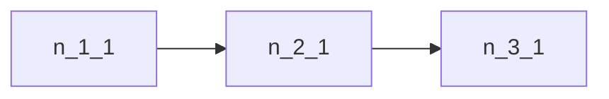
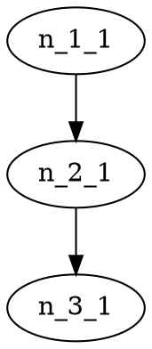

# Flatland Infrastructure Builder / Infrastructure Designer

## Purpose

The Infrastructure Designer is a new UI module for visually creating Flatland-compatible railway infrastructures and complete scenes. A scene is more than track geometry: it captures the infrastructure, operational objects, validation state, and export metadata needed to reuse the design in simulation and analysis workflows.

A scene consists of:

- Grid / infrastructure
- Tracks / TrackCells
- Graph of nodes and edges
- Optional stations
- Trains / agents
- Start and target positions
- Metadata
- Validation status
- Export data

The generated scene should later be usable in:

- `flatland-rl`
- `flatland-scenarios/scenario_generator`
- Next-Flatland UI
- Network graph / graph editor tools

## Core Concepts

- **Infrastructure**: The physical rail topology, represented as grid cells and a derived graph.
- **Scene**: The complete editable artefact: infrastructure, graph, stations, agents, start/target settings, validation, metadata, and layout link information.
- **Grid**: A rectangular coordinate system with fixed width, height, and cell size.
- **TrackCell**: A grid cell that can contain rail topology, station affiliation, and directional connections.
- **Node**: A graph representation of a relevant track cell.
- **Edge**: A graph connection between two nodes, derived from compatible TrackCell connections.
- **Station**: A named marker placed on a valid TrackCell.
- **Agent / Train**: A train definition with optional start and target cells, speed, color, and metadata.
- **Start position**: The cell where an agent begins.
- **Target position**: The cell an agent should reach.
- **Scenario**: A scene prepared for runtime or export, including infrastructure and agents.
- **Layout link**: An optional relation from a scene to a runtime UI layout ID.
- **Export profile**: The target representation for exporting a scene, such as Flatland JSON, scenario YAML, Mermaid, or DOT.

The scene is intentionally broader than infrastructure alone. It includes trains and their start/target configuration so that a saved artefact can later be loaded by runtime tools without reconstructing operational context from UI-only state.

## High-Level User Flow

1. User opens the Infrastructure Designer.
2. User defines grid size, for example width and height.
3. UI shows an empty grid.
4. User draws tracks.
5. UI automatically creates TrackCells and derives a graph from them.
6. User can place stations.
7. User can add trains / agents.
8. For each train, user can set start and target:
   - manually by clicking grid / track cells
   - automatically / randomly
9. User can validate the scene.
10. User can save the scene.
11. User can load a saved scene and continue editing.
12. User can link the scene with a layout.
13. User can export as:
   - Flatland Environment JSON
   - Scenario Generator YAML
   - Mermaid Graph
   - Graphviz DOT

## UI Layout

The MVP uses a three-column layout aligned with the existing Layout Designer.
Only Infrastructure Builder files should be changed for this alignment; the
Layout Designer remains the reference implementation and must not be modified
when polishing the Infrastructure Builder.

Top-level order:

1. Shared `ConfigShell` header.
2. Designer-style action toolbar: `New Scene`, `Save changes` / `Saved`,
  `Save As...`, `Export JSON`, `Import JSON`, `Clear All Scenes`.
3. Designer-style meta row: scene selector, scene name, linked layout, dirty
  status, feedback.
4. Session-grid meta row.
5. Three-column workspace.
6. Footer status.

When starting a new infrastructure session, the user must choose between:

- creating a random infrastructure from the current session grid
- loading a saved infrastructure scene from local storage

This choice dialog must not open automatically when the Infrastructure Builder
page is opened; opening the Builder should preserve the current/default scene
until the user explicitly starts a new infrastructure session.

The dispatcher welcome screen exposes infrastructure selection inline next to
the runtime layout selector. The default option is `Random`. If a saved scene is
selected, the runtime create-session request sends the scene as
`infrastructure_scene`; the backend uses it for the new Flatland session.
Single-connection Builder cells are exported as Flatland dead-end transitions so
scene start/target endpoints remain part of the simulated rail map.
The runtime selector refreshes saved scenes when opened so scenes saved in the
Builder are available before pressing `+ New Session`.
Saved infrastructure scenes can also be deleted from the dispatcher welcome
screen. Deleting resets the selector to `Random`.

### Left Sidebar

- Grid Settings
- Drawing Tools
- Agent Tools
- Randomization Settings
- Validation Panel
- Export Panel

The left sidebar is composed of collapsible widgets using Lyne
`sbb-expansion-panel`. Widgets are independently scrollable through the sidebar
container.

### Center Canvas

- Zoomable / pannable grid
- Track drawing
- Node / edge visualization
- Agent start / target markers
- Station markers
- Selection highlighting

The center column is the main canvas workspace. It owns pan/zoom controls and
must stay usable as a fixed-height workspace with its own internal scrolling.

### Right Sidebar

- Properties Inspector
- Selected cell
- Selected node / edge
- Selected train / agent
- Scene metadata
- Layout link information
- Graph preview summary

The right sidebar is also composed of collapsible Lyne widgets for scene,
selection, selected train, and graph information.

## Canvas Interaction Model

- Track tool: left mouse down and drag draws normal track cells.
- Erase tool: left mouse down and drag removes cells.
- Right click: switches to erase and removes the clicked cell.
- Scroll wheel: zoom.
- Middle mouse drag: pan.
- Overlay pan/zoom controls: same button layout as `flatland-map`.
- Station tool: click track cell to create station.
- Switch tool: click once to create an explicit switch. A second click on the
  same switch toggles its stored switch-facing direction.
- Agent Line tool: first click sets the selected train start, second click sets
  its target. Start and target are written together on the selected agent. If no
  agent is selected, one is created automatically.
- Delete / Backspace: removes selected cell or selected train when focus is not
  in an editable input.

Undo/redo and multi-select are not part of the current MVP.

## Drawing Modes

Tools:

- Select
- Track
- Erase
- Straight Line
- Polyline
- Switch
- Crossing
- Dead-end
- Station
- Agent Start
- Agent Target
- Random Agents

Current MVP implements:

- Select
- Track
- Erase
- Station
- Switch
- Agent Line
- Random Agents

Normal track drawing must not create switches automatically. Non-switch track
cells are capped to straight/curve-style connections. Switches are explicit
cells and may keep three or more connections.

## Data Model

### GridConfig

```ts
export interface GridConfig {
  width: number;
  height: number;
  cellSizePx: number;
}
```

### Direction

```ts
export type Direction = 'N' | 'E' | 'S' | 'W';
```

### TrackCell

```ts
export interface TrackCell {
  id: string;
  x: number;
  y: number;
  kind: TrackCellKind;
  connections: Direction[];
  stationId?: string;
  metadata?: Record<string, unknown>;
}
```

### TrackCellKind

```ts
export type TrackCellKind =
  | 'empty'
  | 'track'
  | 'switch'
  | 'crossing'
  | 'dead-end'
  | 'station';
```

### InfrastructureNode

```ts
export interface InfrastructureNode {
  id: string;
  x: number;
  y: number;
  kind: 'track' | 'switch' | 'crossing' | 'station' | 'dead-end';
  metadata?: Record<string, unknown>;
}
```

### InfrastructureEdge

```ts
export interface InfrastructureEdge {
  id: string;
  from: string;
  to: string;
  direction: Direction;
  bidirectional?: boolean;
  metadata?: Record<string, unknown>;
}
```

### InfrastructureGraph

```ts
export interface InfrastructureGraph {
  nodes: InfrastructureNode[];
  edges: InfrastructureEdge[];
}
```

### Station

```ts
export interface Station {
  id: string;
  name: string;
  x: number;
  y: number;
  metadata?: Record<string, unknown>;
}
```

### InfrastructureAgent

```ts
export interface InfrastructureAgent {
  id: string;
  name: string;
  startCellId?: string;
  targetCellId?: string;
  start?: GridPosition;
  target?: GridPosition;
  color?: string;
  speed?: number;
  metadata?: Record<string, unknown>;
}
```

### GridPosition

```ts
export interface GridPosition {
  x: number;
  y: number;
}
```

### InfrastructureScene

```ts
export interface InfrastructureScene {
  id: string;
  name: string;
  version: string;
  createdAt: string;
  updatedAt: string;
  grid: GridConfig;
  cells: TrackCell[];
  graph: InfrastructureGraph;
  stations: Station[];
  agents: InfrastructureAgent[];
  validation: ValidationResult;
  linkedLayoutId?: string;
  metadata?: Record<string, unknown>;
}
```

### ValidationResult

```ts
export interface ValidationResult {
  valid: boolean;
  errors: ValidationIssue[];
  warnings: ValidationIssue[];
}
```

### ValidationIssue

```ts
export interface ValidationIssue {
  id: string;
  severity: 'error' | 'warning' | 'info';
  message: string;
  cellId?: string;
  nodeId?: string;
  edgeId?: string;
  agentId?: string;
}
```

## Scene Save / Load Concept

The Infrastructure Designer saves and loads scenes with the same user-facing
pattern as the Layout Designer.

The MVP uses `localStorage`. The architecture should allow backend persistence
later by keeping storage behind a service boundary.

The save/load UI lives directly below the shared header, not hidden inside a
sidebar. It exposes:

- `New Scene`
- `Save changes` / `Saved`
- `Save As...`
- `Export JSON`
- `Import JSON`
- `Clear All Scenes`
- scene selector
- editable scene name
- linked layout ID field
- dirty/saved status pill

`InfrastructureSceneStorageService` keeps Layout-Designer-like method names
where possible:

```ts
list(): InfrastructureScene[];
get(id: string): InfrastructureScene | undefined;
save(scene: InfrastructureScene): void;
delete(id: string): void;
activeId(): string | null;
setActive(id: string): void;
exportAll(): InfrastructureSceneExport;
importMany(payload: InfrastructureSceneExport | { scenes?: InfrastructureScene[] }): number;
clearAll(): void;
```

Compatibility methods still exist for scene-specific callers:

```ts
saveScene(scene: InfrastructureScene): void;
loadScene(id: string): InfrastructureScene | null;
listScenes(): InfrastructureSceneSummary[];
deleteScene(id: string): void;
duplicateScene(id: string): InfrastructureScene | null;
exportScene(scene: InfrastructureScene): string;
importScene(json: string): InfrastructureScene;
```

Export-all payload:

```ts
export interface InfrastructureSceneExport {
  version: 1;
  exportedAt: string;
  scenes: InfrastructureScene[];
}
```

Scene summary:

```ts
export interface InfrastructureSceneSummary {
  id: string;
  name: string;
  updatedAt: string;
  gridWidth: number;
  gridHeight: number;
  agentCount: number;
  stationCount: number;
  valid: boolean;
  linkedLayoutId?: string;
}
```

Storage should work similarly to layout designs:

- Scene has ID and name
- Scene can be loaded and edited further
- Scene can be linked with a layout
- Scene can be exported / imported
- Later, runtime can load exactly this scene

## Layout Link Concept

Scenes should be linkable to UI layouts.

Use cases:

- A user creates an infrastructure scene.
- The user links this scene to a runtime layout.
- When opening runtime, the layout can be loaded together with the linked infrastructure scene.
- Layout and scene stay separate artefacts, but can be connected through IDs.

Data model:

```ts
export interface InfrastructureLayoutLink {
  sceneId: string;
  layoutId: string;
  name?: string;
  createdAt: string;
  updatedAt: string;
}
```

MVP:

- only `linkedLayoutId` in the scene model
- no full layout integration required
- UI field in inspector or save panel for selecting / entering a layout ID

## Agent Start / Target Concept

Trains / agents can be created in two ways.

### Manual

- User creates an agent.
- User selects Agent Line tool.
- User clicks a valid TrackCell for start.
- User clicks a second valid TrackCell for target.
- Start and target are saved together on the selected agent.
- Agent is validated.

The canvas uses Flatland-map-like symbols for start and target:

- start: circular train marker with train handle text
- target: ring, center dot, and cross target marker
- hover/title text shows whether the marker is `Start (Agent)` or `Ziel`

### Randomized

- User enters number of agents.
- User clicks Generate Random Agents.
- System picks random valid TrackCells as start and target.
- Start and target must not be identical.
- Optionally, start and target should be reachable once graph reachability exists.

### Validation

- Agent needs start and target.
- Start must be on a TrackCell.
- Target must be on a TrackCell.
- Start and target must not be identical.
- Warn when no route exists between start and target.

## Validation Rules

### MVP Validation

- Grid must have valid width / height.
- TrackCell must be inside grid.
- TrackCell must have at least one connection or be a Station / Dead-end.
- Connections must point to existing neighbour cells.
- Neighbour cell must have matching opposite direction.
- No isolated track pieces.
- Station must be on TrackCell.
- Agent start must be on TrackCell.
- Agent target must be on TrackCell.
- Agent start and target must not be identical.

### Future Validation

- Switch degree 2-3
- Crossing degree 4
- No diagonal edges
- Acyclic graph unless loops are allowed
- Reachability between agent start and target
- Flatland transition compatibility

## Export Formats

### 1. Flatland Environment JSON

```json
{
  "version": "fib-v1",
  "grid": {
    "width": 20,
    "height": 12
  },
  "cells": [],
  "nodes": [],
  "edges": [],
  "stations": [],
  "agents": []
}
```

### 2. Scenario Generator YAML

```yaml
infrastructure:
  version: fib-v1
  grid:
    width: 20
    height: 12
  nodes: []
  edges: []
agents: []
```

### 3. Mermaid Graph



### 4. Graphviz DOT



MVP:

- JSON Export
- Mermaid Export

Future:

- YAML
- DOT

## Architecture

Frontend:

- Angular
- Feature folder under `frontend/src/app/features/infrastructure-builder`
- Local state service using Angular signals or RxJS `BehaviorSubject`
- No mandatory backend in MVP
- `localStorage` persistence

Services:

- `InfrastructureBuilderStoreService`
- `GridGraphConverterService`
- `InfrastructureValidationService`
- `InfrastructureSceneStorageService`
- `InfrastructureExportService`
- `AgentRandomizationService`
- `UndoRedoService`

Components:

- `InfrastructureBuilderComponent`
- `BuilderLeftSidebarComponent`
- `BuilderCanvasComponent`
- `BuilderInspectorComponent`
- `BuilderValidationPanelComponent`
- `BuilderExportPanelComponent`
- `BuilderSceneManagerComponent`
- `BuilderAgentPanelComponent`

File structure:

```text
frontend/src/app/features/infrastructure-builder/
  infrastructure-builder.component.ts
  infrastructure-builder.component.html
  infrastructure-builder.component.scss

  models/
    grid.model.ts
    graph.model.ts
    scene.model.ts
    agent.model.ts
    validation.model.ts
    export.model.ts
    tool.model.ts

  services/
    infrastructure-builder-store.service.ts
    grid-graph-converter.service.ts
    infrastructure-validation.service.ts
    infrastructure-scene-storage.service.ts
    infrastructure-export.service.ts
    agent-randomization.service.ts
    undo-redo.service.ts

  components/
    builder-left-sidebar/
    builder-canvas/
    builder-inspector/
    builder-validation-panel/
    builder-export-panel/
    builder-scene-manager/
    builder-agent-panel/
```

## Implementation Phases

### Phase 1 MVP

- Route or entry point to Infrastructure Builder
- Three-column UI
- Grid settings
- Clickable grid canvas
- Track drawing
- Erase
- Station tool
- Agent start / target tool
- Random agent generation
- Graph generation
- Basic validation
- `localStorage` save / load
- JSON export
- Mermaid export

### Phase 2

- Undo / Redo
- Import / export scene JSON
- Better inspector
- Layout link UI
- Graph preview
- Advanced validation

### Phase 3

- Konva.js or Pixi.js canvas
- Zoom / pan
- Polyline / straight tools
- Switches / crossings / dead-ends
- YAML / DOT export

### Phase 4

- Backend persistence
- `scenario_generator` integration
- Flatland transition map export
- Runtime integration

## Acceptance Criteria

MVP is done when:

- User can open Infrastructure Builder.
- User can create a grid.
- User can draw / delete track cells.
- User can place station markers.
- User can create at least one train.
- User can set train start and target manually.
- User can generate random trains.
- User can validate scene.
- User can save scene to `localStorage`.
- User can load saved scene.
- User can export scene as JSON.
- User can export graph as Mermaid.
- Build succeeds with `npm run build`.
